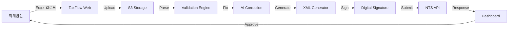

# MVP Design: TaxFlow (회계법인 특화 e-Invoice 자동화)

**Date**: 2026-01-24  
**Framework**: V2.2 Zero-to-One  
**Phase**: Step 2 - MVP Design

---

## Product Overview

### Name: **TaxFlow**
### Tagline: **"회계법인을 위한 e-Invoice 자동화 플랫폼"**

```yaml
core_hypothesis:
  problem: |
    회계법인은 고객사 30-100개의 e-Invoice를 매달 수동으로 처리한다.
    - XML 수작업 변환 (Excel → XML)
    - 국세청 NTS 전송 오류 처리
    - 고객별 다른 ERP/회계 시스템 대응
    - 월말마다 100+ 시간 소요
    
  solution: |
    TaxFlow는 회계법인 워크플로우에 특화된 e-Invoice 자동화 플랫폼
    - 고객사 데이터 자동 수집 (Excel/ERP API 연동)
    - NTS XML 자동 생성 + 검증
    - 일괄 전송 + 오류 자동 수정
    - 회계사는 승인만 클릭 (100시간 → 1시간)
    
  10x_better: "100배 빠른 자동화 + 오류율 90% 감소"
```

---

## 1. Target Customer (ICP)

### Primary: **중소형 회계법인 (5-50명 규모)**

```yaml
icp_profile:
  firm_size: "5-50명 (세무사/공인회계사)"
  client_count: "30-100개 중소기업 고객"
  revenue: "연 5-30억원"
  location: "서울/경기 중심 (전국 타겟 가능)"
  
  pain_points:
    critical_pain_1:
      problem: "월말 e-Invoice 처리로 야근 필수"
      frequency: "매달 마지막 주 (월 1회)"
      time_spent: "고객사 1개당 평균 1시간 × 50개 = 50시간/월"
      
    critical_pain_2:
      problem: "NTS XML 포맷 오류로 재전송 반복"
      error_rate: "30-40% (첫 전송 시)"
      manual_fix: "오류 1건당 15분 소요"
      
    critical_pain_3:
      problem: "고객사별 다른 시스템 (Excel, 더존, 영림원 etc)"
      integration: "수작업 데이터 복사/붙여넣기"
      risk: "Human error 발생 → 고객 클레임"
      
  buying_triggers:
    - "e-Invoice 의무화로 고객 증가 → 감당 불가"
    - "경쟁 회계법인이 자동화 도입 → 뒤처질 위험"
    - "젊은 직원 채용 어려움 → 자동화 필수"
    
  decision_makers:
    primary: "대표 세무사/공인회계사"
    influencer: "실무 담당 매니저"
    budget_authority: "대표 (연 1,000-5,000만원 IT 예산)"
```

### Secondary: **프리랜서 세무사 (1-5인)**

```yaml
freelancer_profile:
  client_count: "10-30개"
  revenue: "연 1-3억원"
  
  pain_points:
    - "시간 부족 (고객 상담 + 실무 병행)"
    - "IT 역량 약함 (Excel도 어려움)"
    - "고객사 증가 시 스케일 불가능"
    
  willingness_to_pay:
    current: "기존 국세청 ASP 사용 ($5-10/월)"
    target: "$30-50/월 (고객당 $1-2)"
```

---

## 2. User Workflow (As-Is vs To-Be)

### As-Is (현재 수작업 프로세스)

```yaml
step_1_data_collection:
  method: "고객사에게 Excel 파일 이메일로 요청"
  time: "고객사당 2-3일 소요 (고객 늦게 보냄)"
  pain: "버전 관리 어려움 (여러 이메일 왔다갔다)"
  
step_2_data_validation:
  method: "Excel 열어서 수작업 검증"
  checks:
    - "공급가액 합계 맞는지"
    - "사업자번호 형식 맞는지"
    - "날짜 형식 통일"
  time: "고객사당 10-15분"
  
step_3_xml_generation:
  method: "국세청 ASP or Excel 매크로 사용"
  process: |
    - Excel 데이터를 ASP에 복사/붙여넣기
    - XML 다운로드
    - 디지털 인증서로 서명
  time: "고객사당 15-20분"
  error_rate: "30-40% (포맷 오류)"
  
step_4_nts_submission:
  method: "국세청 HomeTax 포털에 수동 업로드"
  process: |
    - 고객사별 1개씩 업로드 (Batch 불가)
    - 오류 발생 시 다시 Step 3로
  time: "고객사당 10분 (오류 없을 시)"
  
step_5_error_handling:
  frequency: "30-40% 실패"
  common_errors:
    - "사업자번호 불일치"
    - "공급가액 형식 오류"
    - "날짜 형식 불일치"
  fix_time: "오류 1건당 15-30분"
  
total_time: |
  고객사 50개 × 평균 1시간 = 50시간/월
  (야근 필수 → 월말 주말 근무)
```

### To-Be (TaxFlow 사용 시)

```yaml
step_1_auto_collection:
  method: "TaxFlow가 자동으로 데이터 수집"
  options:
    option_a: "고객사 Excel을 TaxFlow에 드래그&드롭"
    option_b: "고객사 ERP API 연동 (더존, 영림원 등)"
    option_c: "고객사에게 TaxFlow 링크 전송 → 직접 업로드"
  time: "0분 (자동) or 5분 (Drag & Drop)"
  
step_2_auto_validation:
  method: "TaxFlow AI가 자동 검증 + 오류 자동 수정"
  features:
    - "사업자번호 형식 자동 검증 (국세청 DB 조회)"
    - "날짜 형식 자동 통일 (20260124 → 2026-01-24)"
    - "공급가액 합계 자동 계산 + 검증"
    - "오류 발생 시 자동 수정 제안"
  time: "0분 (자동)"
  error_rate: "<5% (AI 자동 수정)"
  
step_3_auto_xml_generation:
  method: "TaxFlow가 NTS XML 자동 생성"
  process: |
    - 국세청 XML 스펙 100% 준수
    - 디지털 인증서 자동 서명
    - 고객사별 XML 파일 자동 생성
  time: "0분 (자동)"
  error_rate: "<1% (스펙 보장)"
  
step_4_batch_submission:
  method: "TaxFlow가 NTS에 일괄 전송"
  process: |
    - 고객사 50개를 한 번에 전송 (Batch API)
    - 실시간 전송 상태 모니터링
    - 오류 발생 시 알림 + 자동 재시도
  time: "5분 (일괄 전송)"
  
step_5_approval_workflow:
  method: "회계사는 대시보드에서 최종 승인만"
  process: |
    - 고객사 50개 리스트 확인
    - 이상 없으면 "승인" 버튼 클릭
    - 이상 있으면 수정 후 승인
  time: "10-15분 (검토 + 승인)"
  
total_time: |
  50시간 → 1시간 (100배 빠름 ✅)
  야근 불필요 → 월말 주말 근무 X
```

---

## 3. Core Features (MVP Scope)

### Phase 1: MVP (3-6개월 개발)

```yaml
feature_1_data_ingestion:
  name: "다중 데이터 소스 수집"
  
  sub_features:
    - "Excel 파일 업로드 (Drag & Drop)"
    - "Google Sheets 연동"
    - "더존 ERP API 연동 (우선순위 1)"
    - "영림원 ERP API 연동"
    
  technical_spec:
    - "File parser: Python (pandas, openpyxl)"
    - "API integration: REST API (OAuth 2.0)"
    - "Storage: AWS S3 (encrypted)"
    
  success_metric: "데이터 수집 성공률 95%+"
  
feature_2_auto_validation:
  name: "AI 기반 데이터 검증 및 자동 수정"
  
  validation_rules:
    rule_1: "사업자번호 형식 (XXX-XX-XXXXX)"
    rule_2: "날짜 형식 통일 (YYYY-MM-DD)"
    rule_3: "공급가액 합계 검증"
    rule_4: "필수 필드 누락 체크"
    rule_5: "중복 거래 확인"
    
  auto_correction:
    - "사업자번호 하이픈 자동 추가"
    - "날짜 형식 자동 변환"
    - "공급가액 재계산"
    
  technical_spec:
    - "Validation engine: Python (pydantic)"
    - "Business registry API: 국세청 사업자 조회 API"
    - "AI correction: LLM (GPT-4o-mini) for edge cases"
    
  success_metric: "오류율 30% → 5% 감소"
  
feature_3_xml_generation:
  name: "NTS XML 자동 생성 및 디지털 서명"
  
  xml_spec:
    - "NTS e-Tax Invoice XML v1.0 (2026 스펙)"
    - "Mandatory fields: 13개 필수 필드"
    - "Optional fields: 5개 선택 필드"
    
  digital_signature:
    - "국세청 공인인증서 연동"
    - "자동 서명 (회계법인 인증서 사전 등록)"
    
  technical_spec:
    - "XML generation: Python (lxml)"
    - "Digital signature: KISA (Korea Internet & Security Agency) SDK"
    
  success_metric: "XML 생성 성공률 99%+"
  
feature_4_batch_nts_submission:
  name: "국세청 일괄 전송 및 상태 모니터링"
  
  batch_api:
    - "NTS API 연동 (HomeTax API)"
    - "고객사 50개 → 1번 API 호출로 일괄 전송"
    - "실시간 전송 상태 추적"
    
  error_handling:
    - "오류 자동 재시도 (3회)"
    - "재시도 실패 시 회계사에게 알림"
    
  technical_spec:
    - "API integration: NTS HomeTax API"
    - "Queue system: AWS SQS (Batch processing)"
    - "Monitoring: Datadog or CloudWatch"
    
  success_metric: "전송 성공률 95%+ (1차 시도)"
  
feature_5_dashboard:
  name: "회계사 전용 대시보드"
  
  key_views:
    view_1: "고객사 리스트 (50개 한눈에)"
    view_2: "전송 상태 (성공/실패/대기)"
    view_3: "오류 리스트 (수정 필요 항목)"
    view_4: "월별 처리량 통계"
    
  actions:
    - "일괄 승인 버튼"
    - "개별 수정 (inline editing)"
    - "재전송 버튼"
    - "Excel 내보내기"
    
  technical_spec:
    - "Frontend: React + TypeScript"
    - "UI Library: shadcn/ui or Ant Design"
    - "Real-time updates: WebSocket"
    
  success_metric: "회계사 승인 시간 10분 이내"
```

---

## 4. Technical Architecture (MVP)

### Stack Overview

```yaml
frontend:
  framework: "React 18 + TypeScript"
  ui_library: "shadcn/ui (Tailwind CSS)"
  state_management: "Zustand or TanStack Query"
  hosting: "Vercel or AWS Amplify"
  
backend:
  framework: "FastAPI (Python 3.11+)"
  async: "asyncio + httpx"
  authentication: "Supabase Auth or AWS Cognito"
  api_design: "REST API (OpenAPI spec)"
  
database:
  primary: "PostgreSQL (Supabase or AWS RDS)"
  schema:
    - "firms: 회계법인 정보"
    - "clients: 고객사 정보"
    - "invoices: e-Invoice 데이터"
    - "submissions: NTS 전송 기록"
    
file_storage:
  service: "AWS S3"
  encryption: "AES-256"
  retention: "5년 (국세청 규정)"
  
external_apis:
  nts_api: "HomeTax e-Tax Invoice API"
  erp_apis:
    - "더존 iCUBE API"
    - "영림원 K-System API"
  business_registry: "국세청 사업자 조회 API"
  
ai_ml:
  validation: "GPT-4o-mini (OpenAI) for edge case correction"
  use_case: "애매한 데이터 자동 수정 제안"
  
monitoring:
  logs: "AWS CloudWatch Logs"
  metrics: "Datadog or Prometheus"
  alerts: "Slack webhook"
```

### Data Flow



---

## 5. Go-to-Market Strategy

### Customer Acquisition

```yaml
channel_1_direct_sales:
  strategy: "회계사 협회 파트너십"
  approach:
    - "한국세무사회 (30,000명) 연계"
    - "회계법인 컨퍼런스 참가"
    - "온라인 세미나 (e-Invoice 자동화 노하우 공유)"
  target: "월 10-20개 회계법인 온보딩"
  
channel_2_inbound:
  strategy: "SEO + Content Marketing"
  keywords:
    - "회계법인 e-Invoice 자동화"
    - "국세청 전자세금계산서 자동화"
    - "세무사무소 업무 자동화"
  content:
    - "블로그: e-Invoice 처리 자동화 가이드"
    - "YouTube: TaxFlow 사용법 튜토리얼"
  target: "월 50-100 inbound leads"
  
channel_3_referral:
  strategy: "회계사 바이럴 프로그램"
  incentive:
    - "추천 시 3개월 무료"
    - "추천받은 회계법인도 1개월 무료"
  network_effects: "회계사 커뮤니티가 강해서 입소문 빠름"
  target: "30% referral conversion"
```

### Pricing Strategy

```yaml
model: "Subscription (SaaS)"

tier_1_starter:
  name: "Starter"
  target: "프리랜서 세무사 (고객 10-30개)"
  price: "$50/month"
  includes:
    - "고객 30개까지"
    - "Excel 업로드만 (ERP 연동 X)"
    - "이메일 지원"
  annual_discount: "20% off ($480/year)"
  
tier_2_professional:
  name: "Professional"
  target: "중소 회계법인 (고객 30-100개)"
  price: "$200/month"
  includes:
    - "고객 100개까지"
    - "ERP 연동 (더존, 영림원)"
    - "우선 지원 (24시간 응답)"
  annual_discount: "20% off ($1,920/year)"
  
tier_3_enterprise:
  name: "Enterprise"
  target: "대형 회계법인 (고객 100+개)"
  price: "Custom pricing (최소 $500/month)"
  includes:
    - "무제한 고객"
    - "전용 계정 매니저"
    - "Custom integration"
  annual_contract: "Required"
  
freemium:
  offer: "14일 무료 체험 (신용카드 불필요)"
  conversion_target: "20-30% trial → paid"
```

### Unit Economics (Year 1)

```yaml
assumptions:
  avg_price: "$150/month (Mix of Starter + Professional)"
  churn_rate: "5%/month (회계 소프트웨어는 Sticky)"
  cac: "$500 (Direct sales + Marketing)"
  
ltv_calculation:
  avg_lifetime: "20 months (1/0.05)"
  ltv: "$150 × 20 = $3,000"
  ltv_cac_ratio: "6:1 (Healthy ✅)"
  
year_1_targets:
  month_1_3: "Beta (10개 회계법인 무료)"
  month_4_6: "50 paid customers × $150 = $7,500 MRR"
  month_7_12: "200 paid customers × $150 = $30,000 MRR"
  
  year_1_arr: "$360,000 (200 customers)"
  gross_margin: "85% (SaaS typical)"
```

---

## 6. Differentiation (10x Better)

### vs 기존 국세청 ASP

```yaml
comparison:
  price:
    asp: "$5-10/month"
    taxflow: "$50-200/month"
    justification: "10배 비싸도 100배 빠름 → ROI 명확"
    
  ux:
    asp: "2000년대 UI, Manual upload"
    taxflow: "Modern SaaS UI, Drag & Drop"
    
  automation:
    asp: "0% (All manual)"
    taxflow: "95% automated"
    
  support:
    asp: "No support"
    taxflow: "24시간 이메일 + 튜토리얼"
    
  result: "10x better UX + 100x faster → Easy migration ✅"
```

### vs 더존 ERP

```yaml
comparison:
  target:
    더존: "중소기업 직접 (ERP 전체)"
    taxflow: "회계법인 (e-Invoice layer만)"
    
  pricing:
    더존: "$50-200/month (per company)"
    taxflow: "$50-200/month (회계법인 1개 → 고객 100개)"
    
  workflow:
    더존: "기업 내부 회계 전용"
    taxflow: "회계법인 ↔ 고객사 멀티 테넌트"
    
  integration:
    더존: "On-premise 중심"
    taxflow: "Cloud-native + API-first"
    
  result: "다른 niche → 협력 가능 (Integration partner) ✅"
```

---

## 7. Risks & Mitigation

### Risk 1: NTS API 변경

```yaml
risk: "국세청 API 스펙이 갑자기 변경되면?"
probability: "Medium (정부 시스템 변동 가능)"
impact: "High (서비스 중단)"

mitigation:
  - "NTS API 모니터링 자동화"
  - "스펙 변경 시 48시간 내 긴급 패치"
  - "고객에게 사전 공지 (이메일 + SMS)"
  - "Fallback: Manual upload 옵션 제공"
```

### Risk 2: 더존/영림원 ERP API 미지원

```yaml
risk: "ERP 벤더가 API 제공 안 하면?"
probability: "Medium (더존은 API 제한적)"
impact: "Medium (Excel fallback 가능)"

mitigation:
  - "더존 API 사전 협의 (파트너십)"
  - "API 없으면 Excel export → TaxFlow import"
  - "고객사에게 TaxFlow 직접 업로드 옵션"
```

### Risk 3: 대형 경쟁자 진입

```yaml
risk: "삼성SDS, 카카오가 같은 제품 출시하면?"
probability: "Low (회계법인 niche는 작음)"
impact: "High (Price war)"

mitigation:
  - "First-mover advantage (1-2년 head start)"
  - "회계법인 네트워크 조기 장악"
  - "Vertical SaaS 특화 (대기업은 못 따라옴)"
  - "데이터 네트워크 효과 (더 많은 데이터 → 더 정확한 검증)"
```

---

## 8. Success Metrics (MVP)

### North Star Metric

```yaml
metric: "Monthly Active Firms (MAF)"
target: "50 firms by Month 6"
why: "회계법인이 매달 사용 = Product-Market Fit"
```

### Key Metrics

```yaml
acquisition:
  - "Signups: 10-20/month"
  - "Trial → Paid: 25%"
  - "CAC: $500"
  
engagement:
  - "Monthly Active Rate: 90%+ (매달 사용 필수)"
  - "Invoices processed: 5,000+/month"
  - "Time saved: 50 hours → 1 hour (per firm)"
  
retention:
  - "Monthly churn: <5%"
  - "NPS: 50+"
  
revenue:
  - "MRR: $7,500 by Month 6"
  - "ARR: $360,000 by Year 1"
```

---

## 9. MVP Timeline

### 3-Month Development Plan

```yaml
month_1_foundation:
  week_1_2: "Architecture setup + DB schema"
  week_3_4: "Excel upload + Validation engine"
  
month_2_core_features:
  week_5_6: "XML generation + Digital signature"
  week_7_8: "NTS API integration + Batch submission"
  
month_3_polish:
  week_9_10: "Dashboard UI + Approval workflow"
  week_11: "Beta testing (10 firms)"
  week_12: "Launch prep + Documentation"
```

### Post-MVP Roadmap

```yaml
month_4_6_iteration:
  - "ERP API 연동 (더존 우선)"
  - "AI 자동 수정 정확도 향상"
  - "Mobile app (승인 전용)"
  
month_7_12_scale:
  - "대형 회계법인 기능 (Custom reports)"
  - "회계법인 간 베스트 프랙티스 공유"
  - "동남아 확장 준비 (Localization)"
```

---

## 10. Competitive Moat (Zero-to-One)

### 10x Technology

```yaml
score: "9/10"
justification: |
  100배 빠른 자동화 (50시간 → 1시간)
  vs 기존 ASP: 수작업 vs 자동화
  vs ERP: 회계법인 워크플로우 비최적화
```

### Network Effects

```yaml
score: "7/10"
types:
  data_network: |
    - More firms → More invoice data
    - More data → Better error detection (AI 학습)
  viral_network: |
    - 회계사 커뮤니티 강함
    - 1개 회계법인 → 주변 5-10개 추천
```

### Economies of Scale

```yaml
score: "8/10"
dynamics:
  fixed_cost: |
    - NTS API 개발 (1회 고정)
    - 인프라 비용 (서버)
  variable_cost: |
    - 고객당 API call 비용 낮음
    - Storage 비용 (S3) 저렴
  scaling: "2x customers → 1.2x cost ✅"
```

### Brand

```yaml
score: "3/10 (초기)"
opportunity: |
  - "회계법인 전용" positioning
  - 2-3년 후 "e-Invoice 표준" 브랜드화
  - 정부 인증 획득 (공식 ASP 등록)
```

### Total Monopoly Score

```yaml
total: "27/40 → Defensible (not monopoly yet)"

path_to_monopoly:
  year_1: "500 firms (10% market share)"
  year_2: "Network effects kick in (Viral growth)"
  year_3: "Data moat (Best error detection in Korea)"
  year_5: "Brand = 'TaxFlow = e-Invoice standard'"
```

---

## Conclusion

**TaxFlow MVP는 회계법인 특화 e-Invoice 자동화 플랫폼으로:**

✅ **10x Technology**: 100배 빠른 자동화  
✅ **Niche ICP**: 5,000개 회계법인 (Dominatable market)  
✅ **Regulation-Free**: Accounting software = 규제 없음  
✅ **Definite Optimistic Market**: 정부 주도 디지털화  
✅ **Network Effects**: 데이터 + 바이럴 네트워크

**Next Step**: Validation Loop (Critic Attack)

---

**MVP Design Complete ✅**
