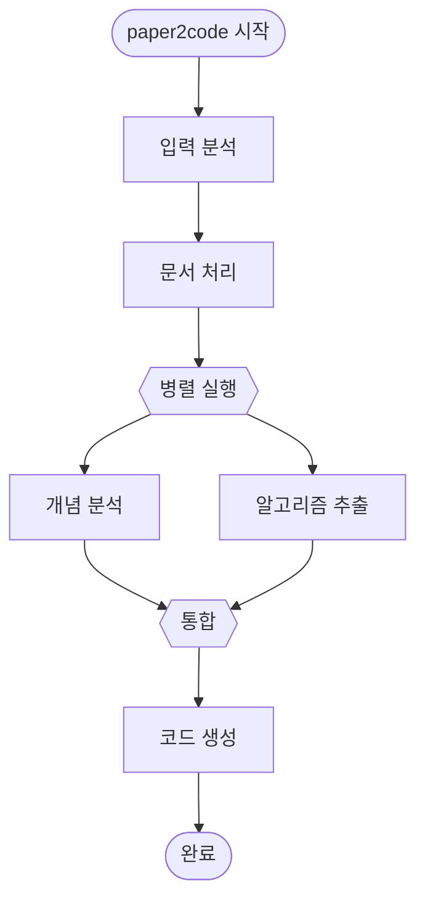

# Junior AX Playbook
## Vibe Coding for Everyone

**Author:** luerre AI  
**Version:** 3.0  
**Last Updated:** 2026-01-17

---

## 📖 이 Playbook은 누구를 위한 것인가요?

**모든 luerre AI 팀원을 위한 Vibe Coding 가이드입니다.**

- ✅ **Junior AX Engineer** - 코딩에만 집중하고 싶은 개발자
- ✅ **AX Architect** - AI로 문서화/이슈 생성을 자동화하려는 설계자
- ✅ **CEO/창업자** - AI 도구로 생산성을 극대화하려는 리더
- ✅ **Admin/Sales/Marketing** - 반복 업무를 자동화하려는 모든 직무

**핵심 개념:**
> Vibe Coding = AI와 함께 일하는 방법론  
> 한 번의 명령으로 원하는 결과를 얻는 기술

---

## 🏠 luerre AI 연결

> **기준 문서**: [../docs/company.md](../docs/company.md)

### Vision
**Make people do what they love**
- 고객이 비즈니스에만 집중할 수 있게
- 개발자가 코딩에만 집중할 수 있게
- **모든 팀원이 본질적인 일에만 집중할 수 있게**

### 각 직무별 Mission

| 직무 | 이 Playbook 활용법 |
|------|-------------------|
| **Junior AX Engineer** | Linear 이슈를 AI로 빠르게 코드로 전환 |
| **Lead AX Engineer** | 팀 전체 생산성 향상을 위한 AI 도구 발굴 |
| **AX Architect** | 고객 미팅 녹음 → AI로 자동 이슈화 |
| **CEO** | 아이디어 검증을 AI 파이프라인으로 자동화 |
| **Admin/Sales/Marketing** | 반복 업무를 Custom Droid로 자동화 |

### Core Values 실천

| Core Value | Vibe Coding에서의 실천 |
|------------|----------------------|
| **No ego, Just impact** | AI 도구 사용을 부끄러워하지 않기, FCSR로 실력 증명 |
| **Don't (just) get shit done** | 왜 하는지 이해하고 AI에게 명령, 의미 없는 자동화 안 함 |

### 팀 철학
우리는 이런 사람을 환영합니다:
- 평생 공부만 했는데 스타트업 씬에 도전해보고 싶은 사람
- The brave dropout - 용기 있게 선택했고, 꾸준히 공부하는 사람
- 은퇴했지만 7살의 마인드셋으로 배우고 싶은 사람
- **AI 시대에 10배 생산성으로 일하고 싶은 모든 사람**


## Table of Contents

1. [The One Number: FCSR](#-the-one-number-fcsr-first-command-success-rate)
2. [The 4C Framework](#-the-4c-framework)
3. [Camcorder - Core Tasks](#1--camcorder-녹화해야-할-핵심-태스크)
4. [Course - Process Manual](#2--course-매뉴얼화된-의식의-흐름)
   - [Chapter 1: Git & Environment](#chapter-1-git--environment-the-foundation)
   - [Chapter 2: Workflow & Debugging](#chapter-2-workflow--debugging-the-flow)
   - [Chapter 3: Architecture & Stack](#chapter-3-architecture--stack-the-structure)
   - [Chapter 4: Prompt Engineering](#chapter-4-prompt-engineering-the-communication)
5. [Cadence - Rhythm & Frequency](#3--cadence-리듬-및-빈도)
6. [Checklist - Success Criteria](#4--checklist-성공-기준)
7. [FCSR Measurement Dashboard](#-fcsr-측정-대시보드)
8. [Quick Start Guide](#-quick-start-guide)
9. [Appendix](#-appendix)


---


## 🎯 The One Number: FCSR (First-Command Success Rate)

호텔의 ADR(객단가)처럼, Vibe Coding의 퍼포먼스를 측정할 단 하나의 지표.

**[VIDEO: FCSR 개념 소개 - 왜 첫 시도 성공률이 중요한가?]**

### 정의 (쉽게 풀어쓰면)

**First-Command Success Rate (첫 번째 명령 성공률)**

AI에게 작업을 시킬 때, 딱 한 번만 명령해서 원하는 결과가 나오는 비율입니다.

**비유로 이해하기:**
레스토랑에서 주문할 때를 생각해보세요.
- ❌ 나쁜 예: "음... 뭐 먹지? 일단 파스타? 아니다 리조또? 역시 파스타로..." (여러 번 왔다갔다)
- ✅ 좋은 예: "크림 파스타 1개, 면은 알덴테로, 치즈 추가 부탁드려요" (한 번에 명확하게)

### 왜 이 숫자가 중요한가?

**1. 시간 낭비를 막습니다**
- 명령 → 실패 → 수정 → 다시 명령... 이 과정이 반복되면 하루가 금방 갑니다
- 한 번에 성공하면 그 시간에 다른 일을 할 수 있습니다

**2. 집중력을 유지합니다**
- 창을 여러 번 전환하면 집중이 깨집니다 (이걸 'Context Switching'이라고 합니다)
- 몰입 상태(Flow)를 유지하는 것이 핵심입니다

**3. 실력의 척도입니다**
- 명확한 명령을 내리는 능력 = AI 시대의 핵심 역량
- 많이 말하는 것보다, 정확하게 한 번 말하는 것이 더 중요합니다

### 계산 방식 (간단합니다!)

```
FCSR = (첫 시도에 성공한 작업 수) ÷ (전체 작업 수) × 100%

예시:
오늘 10개 작업을 했는데, 8개는 한 번에 성공했다면
→ FCSR = 8 ÷ 10 × 100% = 80% ✅
```

**시각화:**
```
전체 작업 10개
├─ ✅ 한 번에 성공: 8개 (80%)
└─ ❌ 재시도 필요: 2개 (20%)

목표: 80% 이상 달성하기!
```

**목표:** 80% 이상


---


## 📘 The 4C Framework

Vibe Coding의 핵심을 4가지 요소로 구조화합니다.

**비유:** 요리 레시피를 만든다고 생각하세요.
- **Camcorder (영상)**: 요리하는 모습을 영상으로 촬영
- **Course (순서)**: 1단계, 2단계... 순서대로 적은 레시피
- **Cadence (주기)**: 언제, 얼마나 자주 만드는지
- **Checklist (체크리스트)**: 맛있게 만들어졌는지 확인 항목

```
┌─────────────────────────────────────────────────┐
│            The 4C Framework                     │
├─────────────────────────────────────────────────┤
│                                                 │
│  1. 🎥 Camcorder  → 보여주기 (영상)             │
│     "이렇게 하는 거구나!"                         │
│                                                 │
│  2. 📚 Course     → 따라하기 (매뉴얼)            │
│     "1단계, 2단계, 3단계..."                      │
│                                                 │
│  3. ⏰ Cadence    → 언제 하기 (스케줄)           │
│     "매일? 매주? 필요할 때?"                      │
│                                                 │
│  4. ✅ Checklist  → 확인하기 (품질 체크)         │
│     "제대로 했나요?"                             │
│                                                 │
└─────────────────────────────────────────────────┘
```


---


## 1. 🎥 Camcorder (녹화해야 할 핵심 태스크)

팀원들이 화면을 보고 "아, 저렇게 하는구나"라고 느낄 수 있는 시연 영상 리스트입니다.

**왜 영상인가?**
- 글로 100줄 설명하는 것보다 2분 영상이 더 효과적입니다
- 실제로 움직이는 모습을 보면 이해가 빠릅니다
- 나중에 다시 볼 때도 편합니다

### Task 1: The "No-Switch" Setup

**목적:** 창을 왔다갔다 하지 않는 작업 환경 만들기

**쉽게 설명하면:**
마우스로 창을 계속 클릭해서 바꾸지 않아도 되는 환경을 만드는 것입니다.
TV 리모컨처럼, 한 곳에서 모든 걸 컨트롤할 수 있게 하는 것이죠.

**[VIDEO: 화면 분할 환경 세팅하기 - 처음부터 끝까지]**

**시연 내용:**
- 화면 분할 방법: 왼쪽에는 코드, 오른쪽에는 실행 결과
- 마우스 없이 키보드만으로 화면 이동하기
- 모든 작업을 한 화면에서 처리하는 모습

**녹화 시점:** 프로젝트 시작 시 환경 세팅 과정

**기대 효과:**
```
Before (창 전환)           After (한 화면)
─────────────────         ─────────────────
클릭 → 전환 → 대기        키보드만으로 즉시 이동
⏱️  시간 소요 많음          ⚡ 빠른 전환
😵 집중력 깨짐             😎 몰입 유지
```


### Task 2: Reference to Product

**목적:** "그냥 만들지 않고, 보고 만드는" 리서치 프로세스

**쉽게 설명하면:**
백화점에 가기 전에 인터넷으로 제품 리뷰를 보는 것과 같습니다.
다른 사람들이 이미 만든 좋은 예시를 먼저 찾아보는 것이죠.

**[VIDEO: 레퍼런스 찾기와 분석하기 - 실전 예시]**

**시연 내용:**
- 만들려는 기능과 비슷한 서비스 3개 찾기
- 각 서비스의 장단점 비교하기
- 좋은 부분만 골라서 우리 프로젝트에 적용하기

**녹화 시점:** 새로운 기능 개발 시작 전

**프로세스 다이어그램:**
```
1단계: 검색           2단계: 비교          3단계: 적용
  🔍                   ⚖️                   ✨
"비슷한 거           "어떤 게            "좋은 것만
 3개 찾기"           제일 좋지?"          가져오기"
    ↓                    ↓                   ↓
 예시 수집  →  스크린샷 저장  →  패턴 추출 → 구현
```


### Task 3: Figma to Code

**목적:** 디자인을 코드로 바꾸기 (정확하게!)

**쉽게 설명하면:**
건축 설계도를 보고 실제 건물을 짓는 것과 같습니다.
디자이너가 만든 예쁜 그림을 실제로 웹/앱에서 똑같이 구현하는 작업이죠.

**[VIDEO: Figma 디자인을 코드로 변환하기 - 트러블슈팅 포함]**

**시연 내용:**
- Figma에서 디자인 정보 추출하는 방법
- 코드로 옮기기
- 안 되면? 강제로라도 똑같이 보이게 만드는 방법 (실전 팁!)

**녹화 시점:** 디자인 구현 단계

**문제 해결 프로세스:**
```
디자인 파일        코드 변환        문제 발생?       강제 해결!
   📐      →        💻      →         ❌      →         ✅
 (Figma)        (작성)          (안 맞음)      (강제 스타일)

"이렇게             "일단              "어? 왜          "그냥 직접
 만들어줘"          코드로"            안 돼?"          넣어버림"
```

**핵심 원칙:**
> 완벽한 코드보다 먼저 "보이게" 만드는 게 우선!  
> 리팩토링(코드 정리)은 나중에 해도 됩니다.


---


## 2. 📚 Course (매뉴얼화된 의식의 흐름)


### Chapter 1: Git & Environment (The Foundation)

**[VIDEO: Git과 작업 환경 완벽 세팅 - 초보자용]**

#### 핵심 원칙
**"마우스로 폴더 클릭하지 말고, 키보드로 명령하세요!"**

#### Step 1: Git 기본 개념 이해하기 (쉬운 비유)

**Git이란?**
- 작업의 "타임머신"이라고 생각하세요
- 과거로 돌아갈 수 있고, 여러 시간선(평행 세계)을 만들 수 있습니다

**필수 개념 (일상 비유):**

```
┌─────────────────────────────────────────────────────────┐
│  Git 개념 = 게임 세이브 파일                              │
├─────────────────────────────────────────────────────────┤
│                                                         │
│  📸 Commit (저장)                                        │
│     → 게임 세이브 파일 저장하기                           │
│     → "여기까지 했어요!" 체크포인트                        │
│                                                         │
│  🌿 Branch (브랜치)                                      │
│     → 세이브 파일 복사해서 다른 엔딩 보기                  │
│     → 본 작업 망칠까봐 복사본에서 실험                     │
│                                                         │
│  🔀 Merge (합치기)                                       │
│     → 두 세이브 파일의 좋은 점만 합치기                    │
│     → "실험 성공했으니 본 작업에 합치자!"                   │
│                                                         │
│  🗂️ Worktree (작업 공간)                                 │
│     → 여러 세이브 파일을 동시에 열어두기                   │
│     → 창 전환 없이 바로바로 확인 가능                      │
│                                                         │
└─────────────────────────────────────────────────────────┘
```

#### Step 2: Git Worktree 설정 (여러 작업을 동시에!)

**[VIDEO: Git Worktree 실전 활용 - 왜 이게 혁신인가]**

**문제 상황 (Before):**

브랜치를 바꿀 때마다 기다려야 합니다.

```
작업 중...
      ↓
브랜치 바꾸기 (git checkout)
      ↓
⏳ 로딩 중... (파일 변경)
      ↓
😵 "아, 뭐 하려고 했더라?"
```

**해결책 (After): Worktree 사용**

여러 작업 공간을 동시에 열어둡니다!

```bash
# 마치 TV 화면 분할처럼 여러 작업 공간 만들기

# 작업 공간 1: 메인 작업
git worktree add ../project-main main

# 작업 공간 2: 새 기능 개발
git worktree add ../project-feature feature-branch

# 작업 공간 3: 긴급 수정
git worktree add ../project-hotfix hotfix-branch
```

**시각화:**
```
┌─────────────────────────────────────────────────┐
│  Before: 하나씩 전환 (느림!)                      │
├─────────────────────────────────────────────────┤
│                                                 │
│  [작업 1] → 전환 → ⏳ → [작업 2] → 전환 → ⏳    │
│                                                 │
└─────────────────────────────────────────────────┘

┌─────────────────────────────────────────────────┐
│  After: 동시에 열어두기 (빠름!)                   │
├─────────────────────────────────────────────────┤
│                                                 │
│  [작업 1]  [작업 2]  [작업 3]                     │
│     ↕️       ↕️       ↕️                         │
│  즉시 이동 가능! 로딩 시간 0초!                    │
│                                                 │
└─────────────────────────────────────────────────┘
```

**기대 효과:**
- ✅ 브랜치 전환 시 로딩 0초
- ✅ 여러 작업을 동시에 진행 가능
- ✅ 집중력 유지 (창 전환 불필요)

#### Step 3: 화면 분할 규칙 (여러 창 동시에 보기)

**[VIDEO: 화면 분할 설정 완벽 가이드 - 실시간 시연]**

**목적:** TV 화면 4분할처럼 모든 정보를 한눈에 보기

**표준 레이아웃 (추천 배치):**

```
┌─────────────────────────────────────────────────┐
│                내 컴퓨터 화면                      │
├─────────────────┬───────────────────────────────┤
│   영역 1         │   영역 2                      │
│   📝 코드 작성   │   🖥️  실행 결과 확인           │
│   (여기서 코딩)  │   (에러 있나 보기)             │
│                 │                               │
│                 │                               │
├─────────────────┴───────────────────────────────┤
│   영역 3: 📦 Git 작업 (저장, 업로드)               │
│   (코드 저장하고 공유하기)                         │
└─────────────────────────────────────────────────┘
```

**비유:**
요리할 때를 생각해보세요
- 영역 1 = 도마 (재료 손질)
- 영역 2 = 불 (요리 상태 확인)
- 영역 3 = 싱크대 (설거지/정리)

**핵심 원칙:**
- ❌ Alt+Tab으로 창 전환 금지
- ✅ 키보드 단축키로 영역 이동
- ✅ 마우스는 코드 작성할 때만 사용

**쉬운 설명:**
> 리모컨으로 채널 바꾸듯이, 키보드 버튼 하나로 화면 영역을 바꿉니다.  
> 마우스로 클릭하러 가는 시간이 없어져요!

#### 권장 도구 (초보자용 설명)

**입문자:**
- **VS Code** + 내장 터미널 분할
  - 가장 쉽고 직관적
  - 버튼 클릭만으로 화면 분할 가능

**중급자:**
- **iTerm2** (Mac) / **Windows Terminal** (Windows)
  - 터미널 전용 앱
  - 더 빠르고 커스터마이징 가능

**고급자:**
- **tmux** + **Vim/Neovim**
  - 최고 효율
  - 마우스 완전 배제 가능


### Chapter 2: Workflow & Debugging (The Flow)

#### Pre-work: Reference First

**원칙:** 유사한 성공 사례 3개 이상 분석 후 코딩 시작

**리서치 체크리스트:**
```
□ 이 기능을 구현한 서비스 3개 찾기
□ 각 서비스의 UX 패턴 스크린샷
□ 기술 스택 추정 (DevTools로 확인)
□ 공통 패턴 추출
□ 우리 프로젝트에 적용 가능한 요소 정리
```

#### Debugging 원칙

**1. 인간의 감에 의존하지 말 것**
- Comet/Codex 등 도구의 로그 분석 결과 신뢰
- "아마 이게 문제일 것 같은데..." → 금지
- 데이터와 로그가 말하게 하라

**2. 디버깅 중 대기 시간 활용**
```bash
# Pane 1: 디버깅 실행
npm run debug

# Pane 2: 로그 모니터링
tail -f debug.log

# Pane 3: 대기 시간 동안 문서 작업
vim README.md
```

**3. Context Switching 금지**
- 터미널 창 하나만 띄우고 멍하니 있지 말 것
- 디버깅이 돌아가는 동안 다른 Pane에서 병렬 작업


### Chapter 3: Architecture & Stack (The Structure)

#### Infra: IaC (Infrastructure as Code) 필수

**원칙:** 무조건 IaC. 클릭으로 서버 띄우기 금지. 코드로 남겨야 자산이 된다.

**권장 도구:**
- **Terraform** (멀티 클라우드)
- **Pulumi** (코드 우선)
- **AWS CDK** (AWS 전용)

**안티패턴:**
```
❌ AWS Console 접속 → EC2 클릭 → Launch Instance
```

**올바른 방법:**
```hcl
# main.tf
resource "aws_instance" "app" {
  ami           = "ami-12345678"
  instance_type = "t3.micro"
  
  tags = {
    Name = "vibe-coding-server"
  }
}
```

```bash
terraform apply  # 한 줄로 인프라 생성
```

#### Database: Supabase 표준화

**이유:**
- Auth, DB, Edge Function 통합
- SQL 직접 작성 가능 (ORM 추상화 회피)
- Real-time 기본 지원

**구성:**
```
Supabase
├── Database (PostgreSQL)
├── Auth (이메일, OAuth, Magic Link)
├── Storage (파일 업로드)
└── Edge Functions (Serverless)
```

#### Design System

**1. Figma 활용**
- `talktofigma` 플러그인으로 디자인 토큰 추출
- 컴포넌트 명세서 자동 생성

**2. Spline 3D Assets 활용 (빠른 프로토타이핑)**

**[VIDEO: Spline에서 3D → React 통합 - 5분 완성]**

**Spline이란?**
- Figma의 3D 버전
- 코드 없이 3D 인터랙티브 요소 제작
- Public URL로 즉시 임베드 가능

**빠른 워크플로우:**

```
┌─────────────────────────────────────────┐
│  Spline → React (5분 완성!)             │
├─────────────────────────────────────────┤
│                                         │
│  1. Spline에서 3D 디자인 (3분)          │
│     ↓                                   │
│  2. Export → Public URL 복사 (30초)     │
│     ↓                                   │
│  3. React에 임베드 (1분)                │
│     ↓                                   │
│  4. 완성! 🎉                            │
│                                         │
└─────────────────────────────────────────┘
```

**Step 1: Spline에서 3D 디자인**

```bash
# 1. https://spline.design 접속
# 2. 템플릿 선택 또는 새로 만들기
# 3. 드래그 앤 드롭으로 3D 오브젝트 배치
# 4. 애니메이션 추가 (선택)
# 5. Export → 'Get embed code' 클릭
```

**Step 2: Public URL 받기**

Spline이 자동 생성한 public URL:
```
https://prod.spline.design/abc123def456/scene.splinecode
```

**Step 3: React/Next.js에 임베드**

**방법 A: iframe (가장 빠름!)**
```jsx
// app/page.tsx
export default function Home() {
  return (
    <div className="w-full h-screen">
      <iframe 
        src="https://prod.spline.design/abc123def456/scene.splinecode"
        frameBorder="0"
        width="100%"
        height="100%"
      />
    </div>
  );
}
```

**방법 B: @splinetool/react-spline (더 많은 제어)**
```bash
# 패키지 설치
npm install @splinetool/react-spline
```

```jsx
// app/page.tsx
'use client';
import Spline from '@splinetool/react-spline';

export default function Home() {
  return (
    <div className="w-full h-screen">
      <Spline 
        scene="https://prod.spline.design/abc123def456/scene.splinecode" 
      />
    </div>
  );
}
```

**방법 C: 이벤트 제어 (인터랙티브)**
```jsx
'use client';
import Spline from '@splinetool/react-spline';
import { useRef } from 'react';

export default function Home() {
  const spline = useRef();

  function onLoad(splineApp) {
    spline.current = splineApp;
  }

  function triggerAnimation() {
    spline.current.emitEvent('mouseDown', 'Cube');
  }

  return (
    <>
      <button onClick={triggerAnimation}>
        Trigger 3D Animation
      </button>
      <Spline
        scene="https://prod.spline.design/abc123def456/scene.splinecode"
        onLoad={onLoad}
      />
    </>
  );
}
```

**실전 예시: Product 3D Viewer**

```jsx
// components/Product3D.tsx
'use client';
import Spline from '@splinetool/react-spline';

export function Product3D({ productId }) {
  const splineUrls = {
    'phone': 'https://prod.spline.design/iphone15/scene.splinecode',
    'laptop': 'https://prod.spline.design/macbook/scene.splinecode',
  };

  return (
    <div className="relative w-full h-96">
      <Spline scene={splineUrls[productId]} />
      
      {/* 오버레이 UI */}
      <div className="absolute bottom-4 left-4">
        <h3 className="text-white text-xl">
          360° 회전해서 보세요
        </h3>
      </div>
    </div>
  );
}
```

**성능 최적화 팁:**

```jsx
// Lazy loading으로 초기 로드 속도 개선
import dynamic from 'next/dynamic';

const Spline = dynamic(
  () => import('@splinetool/react-spline'),
  { ssr: false } // 서버사이드 렌더링 비활성화
);
```

**언제 Spline을 쓰면 좋은가?**

| 상황 | Spline 사용? |
|------|-------------|
| ✅ 랜딩 페이지에 임팩트 있는 3D 히어로 | 추천! |
| ✅ 제품 3D 뷰어 (회전/확대) | 추천! |
| ✅ 프로토타입 빠르게 만들기 | 추천! |
| ✅ 인터랙티브 스토리텔링 | 추천! |
| ❌ 게임 (Three.js 직접 쓰기) | Spline 너무 무거움 |
| ❌ 복잡한 물리 시뮬레이션 | Three.js 추천 |

**핵심 장점:**
- ⚡ Figma처럼 빠른 프로토타이핑
- 🎨 디자이너도 사용 가능 (코드 불필요)
- 🔗 Public URL로 즉시 임베드
- 📱 반응형 자동 지원
- 🎮 기본 인터랙션 내장

**단점:**
- 파일 크기가 클 수 있음 (최적화 필요)
- Three.js보다 제어 범위 적음
- 복잡한 로직은 코드로 직접 작성 필요

**비유:**
```
Figma : 2D 디자인 = Spline : 3D 디자인

Figma → Public URL → iframe
Spline → Public URL → iframe

똑같은 워크플로우!
```

**3. CSS 트러블슈팅**

**문제:** Tailwind가 안 먹힘
```jsx
<div className="bg-blue-500">  {/* 작동 안 함 */}
```

**해결:** 주저 없이 Inline Style로 강제 적용
```jsx
<div style={{ backgroundColor: '#3b82f6' }}>  {/* 강제 적용 */}
```

**원칙:** 보이는 것이 우선. 리팩토링은 나중에.


### Chapter 4: Prompt Engineering (AI에게 명령하는 법)

**[VIDEO: 완벽한 프롬프트 작성법 - Before & After 비교]**

#### 핵심 원칙
**"AI는 친구가 아니라 직원입니다. 명확하게 지시하세요!"**

감정 표현 금지, 애교 금지, 명령만 하세요.

**비유:**
- ❌ 나쁜 예: 친구한테 부탁하듯 "음... 로그인 기능 좀 만들어줄래? 예쁘게~"
- ✅ 좋은 예: 직원한테 지시하듯 "로그인 페이지, Linear 스타일, TypeScript로 작성"

#### 황금 공식: [배경] → [할 일] → [제약사항] → [결과물]

**4단계 템플릿:**
```
┌─────────────────────────────────────────────┐
│  완벽한 명령의 4가지 요소                     │
├─────────────────────────────────────────────┤
│                                             │
│  1️⃣ [Context] 배경 설명                     │
│     → "지금 무슨 프로젝트인지"               │
│                                             │
│  2️⃣ [Action] 할 일                          │
│     → "정확히 뭘 만들어야 하는지"            │
│                                             │
│  3️⃣ [Constraint] 제약사항                   │
│     → "어떤 스타일, 어떤 규칙으로"           │
│                                             │
│  4️⃣ [Output] 결과물 형식                    │
│     → "어떤 파일로 만들지"                   │
│                                             │
└─────────────────────────────────────────────┘
```

#### 실전 비교: 나쁜 예 vs 좋은 예

**❌ 나쁜 예 (이렇게 하지 마세요!):**
```
로그인 기능 좀 만들어 줄래? 예쁘게.
```

**문제점:**
- 🤔 어떤 프로젝트인지 모름
- 🤔 "예쁘게"가 뭔지 모호함
- 🤔 어떤 파일로 만들어야 할지 불명확
- 🤔 결과: AI가 엉뚱한 걸 만들 확률 90%

**✅ 좋은 예 (이렇게 하세요!):**
```
[Context] 
Next.js 프로젝트, Supabase로 인증 처리 중

[Action] 
이메일 로그인 페이지 만들기

[Constraint] 
- 디자인: Linear.app 스타일 참고
- 에러 발생 시 콘솔에 로그 출력
- TypeScript 사용

[Output] 
app/login/page.tsx 파일로 생성
```

**결과 비교:**
```
나쁜 명령 → AI가 헤맴 → 수정 5번 → 2시간 소요 😰
좋은 명령 → 한 번에 완성 → 수정 0번 → 10분 소요 😎
```

#### 프롬프트 템플릿

**기능 구현:**
```
[Context] {기술 스택, 현재 상태}
[Action] {구체적인 기능}
[Constraint] {제약사항, 스타일 가이드}
[Output] {파일 형식, 네이밍 규칙}
```

**버그 수정:**
```
[Context] {에러 로그, 재현 단계}
[Action] {수정할 버그}
[Constraint] {회귀 테스트 필수}
[Output] {수정된 파일 및 테스트 코드}
```

**리팩토링:**
```
[Context] {현재 코드 구조}
[Action] {리팩토링 목표}
[Constraint] {기능 동일성 보장}
[Output] {변경된 파일 리스트}
```


---


### Chapter 5: Custom Droid (나만의 AI 워커 만들기)

**[VIDEO: Custom Droid 만들기 - 반복 작업 자동화]**

#### Droid가 뭔가요?

**비유로 이해하기:**
회사에 전문 직원을 고용하는 것과 같습니다!

```
┌─────────────────────────────────────────┐
│  Droid = 전문 직원                       │
├─────────────────────────────────────────┤
│                                         │
│  일반 AI         vs    Custom Droid     │
│  ─────────            ─────────────     │
│  만능 비서            전문가            │
│  "뭐든 해줘"          "이것만 해줘"     │
│  품질 불안정          품질 일정         │
│                                         │
└─────────────────────────────────────────┘
```

**예시:**
- 🔍 `research-deep-diver` - 심층 리서치 전문가
- 🛡️ `codex-devils-advocate-validator` - 코드 검증 전문가
- 📝 `playbook-creator` - 문서 작성 전문가

**현재 우리 팀 Droid:** `.factory/droids/` 폴더에 22개 활용 중!

#### 언제 만들어야 하나요?

**3가지 신호 (Rule of 3):**

```
□ 같은 작업을 3번 이상 반복했나요?
  → 자동화할 시간!

□ 명령이 10줄 이상으로 길어지나요?
  → Droid로 캡슐화!

□ 팀원들과 공유하고 싶나요?
  → Droid가 표준이 됨!
```

**비유:**
```
레시피를 매번 외워서 말하기 (힘듦)
         vs
레시피 책 만들어두기 (편함)
```

#### 만드는 방법 (2가지)

**방법 1: GenerateDroid Tool 사용 (빠름!)**

```bash
# Factory CLI에서
@GenerateDroid "논문 PDF를 분석해서 핵심 알고리즘만 추출하는 Droid"

# 자동 생성됨!
# → .factory/droids/algorithm-extractor.md
```

**방법 2: 직접 작성 (세밀한 제어)**

```bash
# 1. 파일 생성
touch .factory/droids/my-specialist.md

# 2. 템플릿 작성 (아래 참고)

# 3. 사용!
```

#### Droid 템플릿 구조

**기본 템플릿:**
```markdown
# [Droid 이름]

**Role:** [당신은 누구인가 - 한 줄로]

## 🎯 Mission (임무)

[이 Droid가 정확히 무엇을 하는지]

**핵심 책임:**
- [구체적인 작업 1]
- [구체적인 작업 2]
- [구체적인 작업 3]

## 📋 Input (받는 것)

- [어떤 형식의 입력을 받는지]
- [필수 정보는 무엇인지]

## 🔧 Process (처리 방법)

1. [1단계: 무엇을 하는지]
2. [2단계: 무엇을 하는지]
3. [3단계: 무엇을 하는지]

## 🚫 Constraints (제약사항)

- [지켜야 할 규칙 1]
- [지켜야 할 규칙 2]
- [절대 하지 말아야 할 것]

## 📤 Output (결과물)

**형식:** [마크다운/JSON/코드 등]

**필수 섹션:**
- [Section 1]
- [Section 2]

**예시:**
```
[결과물 샘플]
```

## ✅ Quality Check (품질 기준)

- [ ] [체크 항목 1]
- [ ] [체크 항목 2]
- [ ] [체크 항목 3]
```

#### 실전 예시: Paper Analyzer Droid

```markdown
# Paper Analyzer Droid

**Role:** 논문 PDF에서 핵심 아이디어와 구현 가능한 부분만 추출하는 전문가

## 🎯 Mission

학술 논문을 읽고 엔지니어가 바로 코딩할 수 있게 핵심만 정리합니다.

**핵심 책임:**
- 논문의 핵심 아이디어 요약 (3문장 이내)
- 구현 가능한 알고리즘 추출
- 필요한 라이브러리/기술 스택 제안

## 📋 Input

- 논문 URL 또는 PDF 파일 경로
- (선택) 관심 있는 특정 섹션

## 🔧 Process

1. Abstract와 Conclusion 먼저 읽기
2. Method 섹션에서 알고리즘 추출
3. Related Work에서 레퍼런스 코드 찾기
4. Implementation Notes로 정리

## 🚫 Constraints

- 수식은 의사코드로 변환할 것
- 복잡한 이론은 Skip, 구현 가능한 것만
- 외부 라이브러리 최소화

## 📤 Output

**형식:** Markdown

**필수 섹션:**
- Core Idea (3문장)
- Algorithm (의사코드)
- Tech Stack (추천)
- Implementation Steps

## ✅ Quality Check

- [ ] 엔지니어가 읽고 바로 이해 가능한가?
- [ ] 구현 불가능한 내용은 제외했는가?
- [ ] 레퍼런스 코드 링크가 있는가?
```

#### 사용하는 방법

**방법 1: Task Tool로 호출**
```bash
# Factory CLI에서
@paper-analyzer "https://arxiv.org/abs/1234.5678"
```

**방법 2: Command에 통합**
```json
{
  "step": 1,
  "droid": "@paper-analyzer",
  "action": "논문 분석 및 구현 계획 수립",
  "output": "implementation_plan"
}
```

#### 우리 프로젝트의 Droid들

**Junior AX Engineer가 자주 쓰는 Droid:**

| Droid | 용도 | 언제 사용? |
|-------|------|----------|
| `@algorithm-extractor` | 알고리즘 추출 | 논문 읽을 때 |
| `@code-generator` | 코드 생성 | 구현 계획 완성 후 |
| `@code-planner` | 구현 계획 수립 | 큰 기능 만들기 전 |
| `@reference-miner` | 레퍼런스 검색 | 비슷한 코드 찾을 때 |

**전체 목록:** `.factory/droids/` 폴더 확인 (22개)

#### 팀에 공유하기

**1. Project Droid (팀 전체 공유)**
```bash
# .factory/droids/ 에 저장
# → Git으로 자동 공유됨
```

**2. Personal Droid (나만 사용)**
```bash
# ~/.factory/droids/ 에 저장
# → 내 컴퓨터에만 존재
```

#### 핵심 원칙

```
┌──────────────────────────────────────────┐
│  좋은 Droid = 명확한 전문성              │
├──────────────────────────────────────────┤
│                                          │
│  ❌ "뭐든 잘하는" Droid                   │
│     → 일반 AI랑 차이 없음                │
│                                          │
│  ✅ "이것만 완벽하게" Droid               │
│     → 품질 예측 가능, 재사용 쉬움         │
│                                          │
└──────────────────────────────────────────┘
```

**비유:**
```
종합병원 의사 (만능)  vs  심장 전문의 (전문)
      ↓                        ↓
  일반 AI                 Custom Droid
```


---


### Chapter 6: Command & Visual Flow (작업 흐름 자동화 및 시각화)

**[VIDEO: Command 만들기와 Flow 시각화 - 전체 프로세스]**

#### Command가 뭔가요?

**비유로 이해하기:**
레시피북과 같습니다!

```
┌─────────────────────────────────────────┐
│  Command = 여러 Droid를 조합한 레시피    │
├─────────────────────────────────────────┤
│                                         │
│  요리 레시피              Command        │
│  ───────────              ───────       │
│  재료 준비                Droid 1       │
│    ↓                        ↓          │
│  손질하기                 Droid 2       │
│    ↓                        ↓          │
│  요리하기                 Droid 3       │
│    ↓                        ↓          │
│  완성!                    결과물        │
│                                         │
└─────────────────────────────────────────┘
```

**예시:**
- `paper2code` - 논문을 코드로 변환 (7단계 파이프라인)
- `biz-idea` - 비즈니스 아이디어 검증 (3단계 + 검증 루프)
- `research-idea` - 리서치 아이디어 발굴 (병렬 탐색 + 티키타카 검증)

#### 언제 Command를 만들어야 하나요?

**3가지 신호:**

```
□ 여러 Droid를 순서대로 실행해야 하나요?
  → Command로 자동화!

□ 작업이 3단계 이상인가요?
  → Command로 파이프라인화!

□ 매번 똑같은 순서로 반복하나요?
  → Command가 답!
```

#### Junior AX Engineer가 쓸 Command

**현재 사용 가능한 Command:**

**1. `paper2code` - 논문을 코드로 변환**

**언제 사용?**
- Linear에서 "논문 구현" 이슈를 받았을 때
- 새로운 알고리즘을 공부하며 구현할 때

**어떻게 사용?**
```bash
# 논문 URL이나 파일 경로 입력
paper2code "https://arxiv.org/abs/1234.5678"

# 자동으로 7단계 실행:
# 1. 입력 분석
# 2. 문서 처리
# 3. 개념/알고리즘 분석 (병렬)
# 4. GitHub 레퍼런스 검색
# 5. 코드 인덱싱
# 6. 코드 생성 & 테스트
# 7. 결과물 저장
```

**결과:**
```
/Users/zayden/Documents/assets/paper2code/project-name/
├── src/           # 생성된 코드
├── tests/         # 테스트 파일
├── docs/          # 구현 노트
└── README.md      # 프로젝트 개요
```

**위치:** `.factory/commands/junior-ax-engineer/paper2code.md`

#### Command 구조 이해하기

**기본 구조 (JSON 형식):**
```json
{
  "command": "my-workflow",
  "objective": "이 Command가 무엇을 하는지",
  
  "execution_flow": [
    {
      "step": 1,
      "droid": "@droid-name",
      "action": "무엇을 하는지",
      "output": "결과물 이름"
    },
    {
      "step": 2,
      "parallel": true,
      "agents": [
        {"droid": "@droid-a", "action": "A 작업"},
        {"droid": "@droid-b", "action": "B 작업"}
      ]
    }
  ]
}
```

**핵심 개념:**

**1. Sequential (순차 실행)**
```
Step 1 → Step 2 → Step 3
  ↓        ↓        ↓
결과 1   결과 2   최종 결과
```

**2. Parallel (병렬 실행)**
```
       ┌→ Droid A → 결과 A ─┐
Start ─┤                    ├→ 통합 → 최종
       └→ Droid B → 결과 B ─┘
```

**3. Iterative (반복 실행)**
```
시작 → 실행 → 검증 → Pass?
         ↑           │
         └─ Retry ←─┘ (Fail)
```

#### Visual Flow 만들기

**목적:** Command를 다이어그램으로 시각화해서 팀과 공유!

**[VIDEO: Mermaid 다이어그램 자동 생성하기]**

**방법 1: Mermaid 자동 생성 (추천!)**

```bash
# Command 파일에서 자동으로 다이어그램 생성
python scripts/command-to-mermaid.py .factory/commands/junior-ax-engineer/paper2code.md

# 결과: paper2code.md 파일에 다이어그램 자동 추가!
```

**장점:**
- ✅ GitHub에서 바로 보임
- ✅ 마크다운에 임베드됨
- ✅ 추가 도구 불필요
- ✅ Git으로 버전 관리 가능

**결과 예시 (paper2code):**


**방법 2: 인터랙티브 대시보드 (팀 공유용)**

**[VIDEO: n8n 스타일 대시보드 구축하기]**

```bash
# Next.js + React Flow 대시보드
npx create-next-app@latest vibe-command-dashboard

# 1분 안에 Vercel 배포
vercel

# 결과: https://your-team.vercel.app
```

**장점:**
- 🌐 팀 전체가 웹에서 접속
- 🎨 n8n처럼 드래그/줌 가능
- 🔄 Git push → 자동 업데이트
- 👥 실시간 협업 가능

**상세 가이드:**
- Mermaid 방식: [COMMAND-VISUALIZATION.md](./COMMAND-VISUALIZATION.md)
- 대시보드 구축: [DASHBOARD-SOLUTION.md](./DASHBOARD-SOLUTION.md)

#### 피드백 루프 (Flow를 보고 개선하기)

**Flow 리뷰 체크리스트:**

```markdown
## 내 Command가 효율적인가?

□ 병목 구간이 있나요?
  → 병렬 처리로 개선 가능?
  
  예: 두 개의 순차 작업이 독립적이면 병렬로!

□ 불필요한 단계가 있나요?
  → 통합 가능한 단계는?
  
  예: "분석 → 정리" 를 한 단계로

□ 에러 처리가 충분한가요?
  → quality_gate 추가 필요?
  
  예: 결과물 검증 단계 추가

□ 팀원이 이해 가능한가요?
  → 명확한 라벨링?
  
  예: "Step 1" 대신 "논문 분석"
```

**개선 사이클 (지속적 개선):**
```
┌──────────────────────────────────────┐
│  Command 개선 사이클                  │
├──────────────────────────────────────┤
│                                      │
│  1. Command 작성                     │
│     ↓                                │
│  2. Flow 자동 생성 (Mermaid)         │
│     ↓                                │
│  3. 팀 리뷰 (대시보드에서)           │
│     ↓                                │
│  4. 피드백 반영                      │
│     ↓                                │
│  5. Command 수정                     │
│     ↓                                │
│  6. 반복! 🔄                         │
│                                      │
└──────────────────────────────────────┘
```

**실전 예시:**

**Before (비효율):**
```json
{
  "execution_flow": [
    {"step": 1, "action": "분석 A"},
    {"step": 2, "action": "분석 B"},  // 순차
    {"step": 3, "action": "통합"}
  ]
}
```

**After (개선):**
```json
{
  "execution_flow": [
    {
      "step": 1,
      "parallel": true,  // 병렬로 변경!
      "agents": [
        {"action": "분석 A"},
        {"action": "분석 B"}
      ],
      "fan_in": {"action": "통합"}
    }
  ]
}
```

**결과:**
```
시간: 10분 → 5분 (50% 단축!)
```

#### 실전 워크플로우

**Junior AX Engineer의 하루:**

```
아침: Linear 이슈 확인
  ↓
"논문 구현" 이슈 발견
  ↓
paper2code 실행
  ↓
코드 자동 생성
  ↓
테스트 확인 → Pass!
  ↓
PR 올리기
  ↓
Flow 다이어그램 팀 공유
  ↓
피드백 받기
  ↓
Command 개선
```

#### 핵심 원칙

```
┌──────────────────────────────────────────┐
│  Command = 반복 작업의 자동화            │
├──────────────────────────────────────────┤
│                                          │
│  수동 반복 (Before)                      │
│  ─────────────                           │
│  1. 논문 읽기 (30분)                     │
│  2. 알고리즘 정리 (1시간)                │
│  3. 레퍼런스 찾기 (30분)                 │
│  4. 코드 작성 (2시간)                    │
│  5. 테스트 (30분)                        │
│  ────────────                            │
│  Total: 4.5시간                          │
│                                          │
│  Command 실행 (After)                    │
│  ──────────────                          │
│  paper2code "url"                        │
│  ────────────                            │
│  Total: 10분 + 검토 20분 = 30분!         │
│                                          │
└──────────────────────────────────────────┘
```

**마지막 팁:**

> Command는 레시피, Droid는 요리사!  
> 레시피(Command)를 잘 짜면, 요리사(Droid)가 완벽하게 실행합니다.

**다음 단계:**
1. `.factory/commands/junior-ax-engineer/` 폴더 확인
2. `paper2code.md` 읽어보기
3. 직접 실행해보기
4. Flow 다이어그램 생성해보기
5. 팀에 공유하고 피드백 받기


---


## 3. ⏰ Cadence (리듬 및 빈도)

**언제, 얼마나 자주 해야 하는지에 대한 가이드입니다.**

**비유:** 운동 루틴처럼, 언제 무엇을 해야 하는지 정해두면 헷갈리지 않습니다.

**[VIDEO: 효율적인 작업 스케줄 만들기]**

### Always (항상 유지할 것)

**터미널 분할 상태 유지**

작업을 시작할 때마다 화면을 분할해두세요.

세팅 스크립트 예시:
```bash
#!/bin/bash
# vibe-setup.sh

# tmux 세션 시작
tmux new-session -d -s vibe

# Pane 1: Editor
tmux send-keys -t vibe "cd ~/project && vim ." C-m

# Pane 2: Server Log
tmux split-window -h -t vibe
tmux send-keys -t vibe "cd ~/project && npm run dev" C-m

# Pane 3: Git Operations
tmux split-window -v -t vibe
tmux send-keys -t vibe "cd ~/project && git status" C-m

# Attach
tmux attach -t vibe
```

작업 시작 시:
```bash
./vibe-setup.sh
```

### Before Start (작업 시작 전에 꼭!)

**Reference Check (레퍼런스 확인)**

**원칙:** 코딩 시작 전에 반드시 예시를 찾아보세요!

**비유:** 
요리하기 전에 레시피를 보는 것과 같습니다. 
"일단 해보고 안 되면 고치자"는 시간 낭비!

**시작 전 체크리스트:**
```
┌──────────────────────────────────────────┐
│  작업 시작 전 필수 확인 사항               │
├──────────────────────────────────────────┤
│  □ 비슷한 기능 예시 3개 찾았나요?          │
│  □ 공식 문서 읽었나요?                    │
│  □ 얼마나 어려운 작업인지 판단했나요?      │
│  □ 몇 시간 걸릴지 예상했나요?             │
└──────────────────────────────────────────┘

✅ 모두 체크했으면 시작하세요!
```

### Deployment (배포 시점)

**IaC 스크립트 실행**

```bash
# 인프라 변경사항 확인
terraform plan

# 적용
terraform apply

# 코드 배포
git push origin main

# 상태 모니터링
./monitor.sh
```


---


## 4. ✅ Checklist (성공 기준)

**작업이 정말로 제대로 끝났는지 확인하는 체크리스트입니다.**

**비유:** 
비행기 조종사의 이륙 전 체크리스트처럼, 
하나라도 빠뜨리면 안 되는 필수 확인 사항들입니다.

**[VIDEO: 작업 완료 전 최종 검증 프로세스]**

```
┌────────────────────────────────────────────┐
│  작업 완료 = 5가지 모두 ✅                  │
├────────────────────────────────────────────┤
│  하나라도 ❌면 미완성입니다!                │
└────────────────────────────────────────────┘
```

### 필수 체크리스트 (5가지)

#### [ ] 1. 창 전환 안 했나요? (No Context Switching)

**질문 (쉽게):** 
작업하는 동안 마우스로 창을 여기저기 바꿨나요?

**합격 기준:** 
아니오! 키보드만 사용했고, 화면 분할 상태를 유지했어야 합니다.

**왜 중요한가요?**
```
창 전환 많음          창 전환 없음
    ↓                    ↓
집중력 분산          몰입 상태 유지
    ↓                    ↓
시간 2배 소요        빠른 완료
```

**확인 방법:**
- 화면 녹화해서 Alt+Tab 눌렀는지 확인
- "마우스로 다른 창 클릭한 적 있나?" 스스로 질문하기


#### [ ] 2. 레퍼런스 참고했나요? (Reference Based)

**질문 (쉽게):** 
비슷한 기능을 가진 다른 서비스를 찾아보고 참고했나요?

**합격 기준:** 
최소 1개, 가능하면 3개 이상의 예시 사이트를 찾아봤어야 합니다.

**왜 중요한가요?**
```
레퍼런스 없이         레퍼런스 보고
    ↓                     ↓
헤매면서 만듦         정확하게 만듦
    ↓                     ↓
품질 낮음             품질 높음
```

**제출 형식 예시:**
```markdown
## 참고한 사이트 (References)

1. [Linear.app 로그인](https://linear.app/login)
   - 심플한 이메일 입력 방식
   - 에러 메시지 표시 방법 참고
   
2. [Notion 로그인](https://notion.so/login)
   - 구글 로그인 연동 방식
   - 로딩 중일 때 표시 방법
   
3. [Vercel 로그인](https://vercel.com/login)
   - 이메일 링크 로그인 방식
   - 부드러운 애니메이션 효과
```


#### [ ] 3. 서버 설정을 코드로 저장했나요? (IaC Compliance)

**질문 (쉽게):** 
서버나 인프라 설정을 변경했다면, 그걸 코드 파일로 저장했나요?

**합격 기준:** 
마우스로 클릭해서 설정 변경하면 안 됩니다. 
모든 설정은 코드 파일(`.tf`, `.yaml` 등)로 저장해야 합니다.

**왜 중요한가요?**
```
클릭으로 설정          코드로 설정
    ↓                     ↓
기록 안 남음          파일로 저장됨
    ↓                     ↓
나만 알고 있음        누구나 재현 가능
    ↓                     ↓
내가 없으면 문제      팀원도 할 수 있음
```

**비유:**
레고 조립 설명서와 같습니다. 
설명서 없이 만들면 다른 사람이 똑같이 만들 수 없어요!

**확인 방법:**
```bash
# 인프라 설정 파일이 있는지 확인
ls infrastructure/

# Git에 저장되었는지 확인
git log --all -- infrastructure/
```


#### [ ] 4. 모든 화면 크기에서 정상인가요? (Design Force)

**질문 (쉽게):** 
컴퓨터, 태블릿, 핸드폰에서 모두 제대로 보이나요?

**합격 기준:** 
"나중에 고칠게요" 안 됩니다! 지금 당장 모든 화면에서 예쁘게 보여야 합니다.

**왜 중요한가요?**
```
나중에 고치기          지금 당장 완성
    ↓                      ↓
"나중에"는 안 옴       바로 사용 가능
    ↓                      ↓
미완성 상태            완성품
```

**테스트할 화면 크기:**
```
┌─────────────────────────────────────┐
│ 체크해야 할 3가지 화면 크기           │
├─────────────────────────────────────┤
│ □ 데스크탑 (큰 모니터)               │
│   1920 x 1080                       │
│                                     │
│ □ 태블릿 (아이패드)                  │
│   768 x 1024                        │
│                                     │
│ □ 모바일 (아이폰/갤럭시)             │
│   375 x 667                         │
└─────────────────────────────────────┘
```

**문제 해결 순서:**
1. 먼저 Tailwind CSS로 시도
2. 안 되면 CSS 파일로 스타일 작성
3. 그래도 안 되면? 직접 스타일 코드에 넣어버리기! (강제 적용)

**핵심:**
> 완벽한 코드 < 당장 보이는 결과물  
> 코드 정리는 나중에!


#### [ ] 5. 명령을 명확하게 했나요? (Prompt Cleanliness)

**질문 (쉽게):** 
AI에게 명령할 때 "해줄래요?", "부탁드려요" 같은 말 안 썼나요?

**합격 기준:** 
친구한테 부탁하듯 말하면 안 됩니다. 직원한테 지시하듯 명확하게!

**왜 중요한가요?**
```
애매한 부탁           명확한 명령
    ↓                    ↓
AI가 헷갈림          AI가 정확히 이해
    ↓                    ↓
잘못된 결과          원하는 결과
```

**비유:**
택시 기사에게 길 알려줄 때
- ❌ "음... 저기... 어디였더라... 시청 쪽으로 가주실 수 있을까요?"
- ✅ "시청역 3번 출구 앞까지 가주세요"

**나쁜 예 ❌:**
```
안녕하세요! 로그인 기능을 만들어주실 수 있을까요? 
예쁘게 부탁드립니다~
```

**좋은 예 ✅:**
```
[Context] Next.js + Supabase Auth 프로젝트
[Action] 이메일 로그인 페이지 만들기
[Constraint] Linear.app 스타일, TypeScript 사용
[Output] app/login/page.tsx 파일로 생성
```

**핵심 차이:**
| 나쁜 명령 | 좋은 명령 |
|---------|---------|
| 애교 많음 😊 | 감정 없음 🤖 |
| 모호함 🤔 | 명확함 ✅ |
| 선택권 줌 | 지시함 |


---


## 📊 FCSR 측정 대시보드

### 주간 리포트 템플릿

```markdown
## Weekly Vibe Coding Report

**Week:** 2026-01-13 ~ 2026-01-19  
**Developer:** [이름]

### FCSR (First-Command Success Rate)
- **총 태스크:** 20개
- **첫 시도 성공:** 16개
- **FCSR:** 80% ✅

### 4C Compliance
- [x] Camcorder: 3개 영상 녹화 완료
- [x] Course: Chapter 1-4 숙지
- [x] Cadence: 매일 vibe-setup.sh 실행
- [x] Checklist: 5개 항목 100% 준수

### 이번 주 하이라이트
- Git Worktree 도입 후 브랜치 전환 시간 90% 단축
- Reference 3개 기반 로그인 기능 구현, 첫 시도 성공

### 개선 필요 사항
- CSS 트러블슈팅 시간 단축 필요
- Prompt Engineering 정확도 향상
```


---


## 🚀 Quick Start Guide

**처음 시작하는 분들을 위한 3일 속성 가이드**

**[VIDEO: Vibe Coding 시작하기 - Day 1 to Day 3 완벽 가이드]**

### 1일차: 환경 설정하기

**목표:** 작업 환경 세팅 완료하기

**할 일:**
```bash
# 1. Git Worktree 설정 (여러 작업 공간 만들기)
git worktree add ../project-main main
git worktree add ../project-dev develop

# 2. 화면 분할 스크립트 만들기
./vibe-setup.sh
```

**확인:**
- [ ] 화면이 3개 영역으로 나뉘어 있나요?
- [ ] 키보드만으로 영역 이동이 가능한가요?

### 2일차: 첫 작업 해보기

**목표:** 첫 번째 작업을 FCSR 80% 목표로 완료하기

**단계별 진행:**
1. **Reference 찾기** (비슷한 예시 3개)
2. **Prompt 작성** (4가지 요소 모두 포함)
   - Context (배경)
   - Action (할 일)
   - Constraint (제약사항)
   - Output (결과물)
3. **코드 생성** (한 번에 성공 목표!)
4. **Checklist 검증** (5가지 모두 체크)

**확인:**
- [ ] 한 번에 성공했나요?
- [ ] 5가지 체크리스트 모두 통과했나요?

### 3일차: 기록하고 개선하기

**목표:** 내 FCSR 점수 측정하고 개선점 찾기

**할 일:**
```
1. 오늘 완료한 작업 개수 세기
2. 첫 시도에 성공한 작업 개수 세기
3. FCSR 계산하기 (성공 ÷ 전체 × 100)
4. 왜 실패했는지 분석하기
```

**기록 양식:**
```markdown
## 나의 FCSR 기록

날짜: 2026-01-17
- 전체 작업: 10개
- 첫 시도 성공: 6개
- FCSR: 60%

### 개선할 점:
- Reference를 충분히 안 찾아봤음
- Prompt가 너무 짧았음
```


---


## 📚 Appendix

### 권장 도구 스택

**Terminal:**
- Ghostty

**Editor:**
- Neovim (최고 효율)
- VS Code (입문자 추천)

**AI Coding:**
- Codex
- GitHub Copilot
- Cursor

**Infrastructure:**
- Terraform
- Pulumi
- Supabase

### 추천 학습 자료

1. **Git Worktree 마스터**
   - [Git Worktree 공식 문서](https://git-scm.com/docs/git-worktree)
   
2. **Prompt Engineering**
   - [OpenAI Best Practices](https://platform.openai.com/docs/guides/prompt-engineering)
   
3. **IaC 입문**
   - [Terraform Tutorial](https://learn.hashicorp.com/terraform)


---


## 🎯 마무리: Vibe Coding의 본질

**Vibe Coding이란 무엇인가요?**

간단히 말하면:
```
┌─────────────────────────────────────────┐
│  Vibe Coding = 몰입의 기술              │
├─────────────────────────────────────────┤
│                                         │
│  1. 환경을 완벽하게 세팅하고             │
│     (화면 분할, Git Worktree)           │
│                                         │
│  2. 집중을 깨뜨리지 않으며               │
│     (창 전환 금지)                      │
│                                         │
│  3. 명확한 명령을 내려서                │
│     (4요소 프롬프트)                    │
│                                         │
│  4. 한 번에 완성하는 것                 │
│     (FCSR 80% 목표)                    │
│                                         │
└─────────────────────────────────────────┘
```

**비유로 이해하기:**

스타크래프트 프로게이머를 생각해보세요.
- ❌ 아마추어: 마우스로 여기저기 클릭하며 헤맴
- ✅ 프로: 키보드 단축키로 빠르게 명령, 한 번도 멈추지 않음

Vibe Coding도 마찬가지입니다!

**실천 3원칙:**

1. **FCSR 80% 이상 유지하기**
   - 10번 작업하면 8번은 한 번에 성공하기

2. **4C Framework 따르기**
   - 영상 → 매뉴얼 → 스케줄 → 체크리스트

3. **매일 조금씩 개선하기**
   - 오늘의 FCSR > 어제의 FCSR

**마지막 조언:**

> **"마우스로 창을 왔다갔다 하지 마세요."**  
> **키보드 하나로 모든 걸 컨트롤하세요.**

**Go Vibe, Stay Flow.** 🚀

---

**이 Playbook이 도움이 되셨나요?**

- FCSR 기록을 매일 남기세요
- 팀원들과 공유하세요
- 계속 개선해 나가세요

**당신의 생산성 혁명은 지금 시작됩니다!** ⚡
